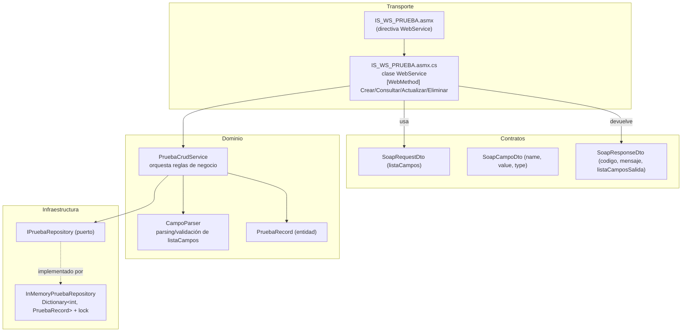
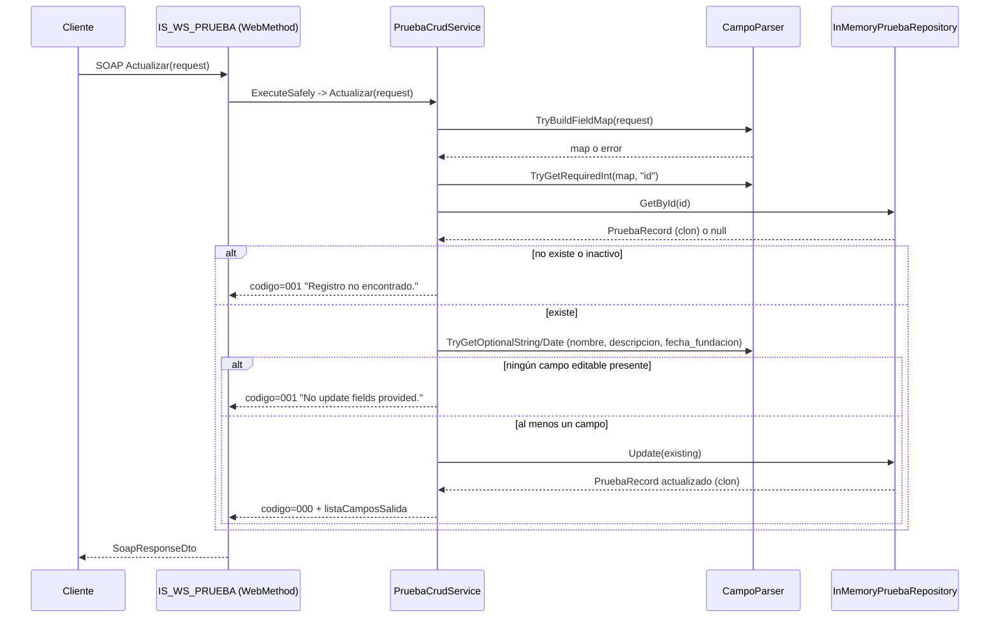

# Blueprint — `IS_WS_PRUEBA`

> Servicio web SOAP/ASMX de tipo CRUD genérico, construido sobre .NET Framework 4.0.
> Análisis realizado sobre el estado actual del código en el directorio de trabajo.

---

## 1. Resumen ejecutivo

`IS_WS_PRUEBA` es un **web service SOAP clásico (ASMX/.asmx)** que expone cuatro operaciones CRUD (`Crear`, `Consultar`, `Actualizar`, `Eliminar`) sobre una única entidad de negocio (`PruebaRecord`, una especie de "empresa" con nombre, descripción y fecha de fundación).

Lo particular del diseño es que **no usa parámetros tipados por operación**: todas las operaciones reciben y devuelven una estructura genérica de pares `{name, value, type}` (`listaCampos` / `listaCamposSalida`), similar a un "bag" de campos dinámico. Esto lo hace parecer un *framework interno de integración* (al estilo de servicios legacy usados para desacoplar contratos SOAP de los cambios de esquema), sacrificando fuertemente el tipado fuerte y la autodocumentación del WSDL a cambio de flexibilidad.

La persistencia es **en memoria** (`Dictionary<int, PruebaRecord>` estático protegido por `lock`), sin base de datos real. Todo indica que es un **proyecto de prueba / plantilla de referencia** (el propio namespace `.../IS_WS_PRUEBA/v1`, el nombre "PRUEBA", y la carpeta `docs/soap` con un pipeline documentado de "subagentes" que generaron el contrato, el esqueleto, el CRUD y una validación de calidad, lo confirman).

**Estado:** funcionalmente completo para su alcance de demo, pero **no apto para producción** sin cambios (persistencia real, seguridad, autenticación, tests automatizados).

---

## 2. Contexto y evidencia de origen

En `docs/soap/06-resumen-final.md` hay un reporte de un pipeline de generación automática (agentes: `soap-contract-designer`, `asmx-skeleton-generator`, `crud-implementer`, `soap-interoperability-validator`, `quality-security-gatekeeper`) que documenta exactamente este mismo servicio, con las mismas limitaciones que se detectan aquí de forma independiente (persistencia en memoria, sin pruebas automatizadas, sin versionado de contrato). Esto es información valiosa: **el propio proceso que creó el servicio ya identificó sus principales riesgos**, y este blueprint los confirma y los profundiza con detalles concretos de código.

---

## 3. Arquitectura

Arquitectura en capas, minimalista pero con separación de responsabilidades correcta para su tamaño:



Namespaces C#:

- `Legacy.Services.IS_WS_PRUEBA` — clase de servicio (`IS_WS_PRUEBA.asmx.cs`)
- `Legacy.Services.IS_WS_PRUEBA.Contracts` — DTOs SOAP + metadata del contrato
- `Legacy.Services.IS_WS_PRUEBA.Domain.Entities` — entidad de dominio
- `Legacy.Services.IS_WS_PRUEBA.Domain.Services` — lógica de negocio y parsing
- `Legacy.Services.IS_WS_PRUEBA.Infrastructure` — repositorio y su interfaz

Esto es, en esencia, **Ports & Adapters (arquitectura hexagonal) en miniatura**: `IPruebaRepository` es el puerto, `InMemoryPruebaRepository` es el adaptador. Cambiar a SQL Server, por ejemplo, implicaría solo escribir un nuevo adaptador sin tocar `PruebaCrudService` ni el contrato SOAP.

### 3.1 Stack tecnológico

| Aspecto | Valor |
|---|---|
| Framework | .NET Framework **4.0** (`TargetFrameworkVersion v4.0`) — lanzado en 2010, fuera de soporte |
| Tipo de proyecto | Web Application (ASMX), `OutputType: Library` |
| Protocolo | SOAP 1.1 (WS-I Basic Profile 1.1) + `HttpPost` habilitado |
| Serialización | `System.Xml.Serialization` (atributos `XmlElement`, `XmlArray`, `XmlArrayItem`, `XmlType`) |
| Estilo de código | C# "estilo .NET 2.0/3.0": `out` params, sin `async/await`, sin LINQ para lógica de validación, delegados anónimos (`delegate { ... }`) en vez de lambdas |
| Persistencia | Ninguna real — `Dictionary` estático en memoria de proceso |
| Tests | **No existen** (ni proyecto de test, ni carpeta `tests`) |
| CI/CD | No hay archivos de pipeline en el repo |

---

## 4. Contrato SOAP

- **Namespace del servicio:** `http://legacy.projectia.local/soap/IS_WS_PRUEBA/v1` (`Contracts/ServiceContractMetadata.cs`)
- **WSDL congelado:** `docs/soap/IS_WS_PRUEBA.wsdl` (capturado en runtime como evidencia)
- **Perfil de interoperabilidad:** `WsiProfiles.BasicProfile1_1`

### 4.1 Forma genérica de entrada/salida

En vez de exponer parámetros tipados (`Crear(string nombre, string descripcion, DateTime fechaFundacion)`), **todas** las operaciones reciben un `SoapRequestDto`:

```xml
<listaCampos>
  <campo><name>nombre</name><value>Empresa XYZ</value><type>string</type></campo>
  <campo><name>descripcion</name><value>Proveedor nacional</value><type>string</type></campo>
  <campo><name>fecha_fundacion</name><value>2020-10-15</value><type>datetime</type></campo>
</listaCampos>
```

Y devuelven un `SoapResponseDto` uniforme:

```xml
<codigo>000</codigo>
<mensaje>Registro creado.</mensaje>
<listaCamposSalida>
  <campo><name>id</name><value>1</value><type>int</type></campo>
</listaCamposSalida>
```

**Ventaja:** el WSDL/contrato XML no cambia aunque se agreguen o quiten campos de negocio — útil para integraciones legacy donde regenerar el WSDL en cada cliente es costoso.
**Costo:** se pierde el tipado fuerte que el propio WSDL podría dar (todo es `string` a nivel de transporte), el cliente no tiene autocompletado/validación de esquema real, y toda la validación de tipo (`"nombre" debe ser string`, `"id" debe ser int`) queda delegada a **código de aplicación en runtime** (`CampoParser`) en lugar de al esquema XML.

### 4.2 Operaciones y reglas de campos

| Operación | Campos de entrada requeridos | Opcionales | Reglas |
|---|---|---|---|
| `Crear` | `nombre:string`, `descripcion:string`, `fecha_fundacion:datetime` | — | Crea con `activo=true` siempre; el cliente no puede fijar `activo` en la creación |
| `Consultar` | `id:int` | — | Solo devuelve el registro si existe **y** `activo=true` (soft-deleted = "no encontrado") |
| `Actualizar` | `id:int` | `nombre`, `descripcion`, `fecha_fundacion` (al menos uno) | Falla si el registro no existe o está inactivo; falla si no se envía ningún campo editable |
| `Eliminar` | `id:int` | — | Borrado **lógico** (`activo=false`); falla si ya estaba inactivo ("Registro ya eliminado") |

### 4.3 Formatos de fecha aceptados (`CampoParser.AllowedDateFormats`)

- `yyyy-MM-dd`
- `yyyy-MM-ddTHH:mm:ss`
- `yyyy-MM-ddTHH:mm:ssZ`

Parseo con `DateTimeStyles.AssumeUniversal | AdjustToUniversal`: cualquier fecha sin offset se **asume UTC**, lo cual es una decisión de negocio implícita no documentada en el contrato (un cliente que mande hora local sin `Z` verá su hora reinterpretada como UTC silenciosamente).

### 4.4 Códigos de respuesta (`codigo`)

| Código | Significado | Origen |
|---|---|---|
| `000` | Éxito | `PruebaCrudService.Success` |
| `001` | Error funcional (validación de negocio, campo faltante, "no encontrado", etc.) | `PruebaCrudService.FunctionalError` |
| `900` | Error técnico no controlado (excepción) | `PruebaCrudService.TechnicalError` / `ExecuteSafely` en el WebService |

Este es un patrón de "envelope de resultado" típico de integraciones legacy (SAP, mainframes, ESBs) — el llamador **siempre** recibe HTTP 200 con SOAP válido, y el estado real va en `codigo`/`mensaje`, nunca como SOAP Fault. Es deliberado para máxima compatibilidad con clientes SOAP antiguos que no manejan bien los Faults, pero tiene contras (ver §7).

---

## 5. Flujo de una operación (ejemplo: `Actualizar`)



Todas las operaciones siguen el mismo esqueleto: `try { construir mapa de campos -> validar -> ejecutar regla de negocio -> repositorio } catch { TechnicalError }`, con doble red de seguridad (el `try/catch` interno de cada método de `PruebaCrudService` **y** el `ExecuteSafely` del `WebService`).

---

## 6. Persistencia (`InMemoryPruebaRepository`)

- **Singleton clásico** (`private static readonly InstanceValue`, constructor privado).
- Estado compartido: `Dictionary<int, PruebaRecord>` + contador `_nextId`, ambos `static` — es decir, **compartidos por todas las instancias del WebService** (ASP.NET crea una instancia de `WebService` por request, pero el repositorio vive a nivel de `AppDomain`).
- **Thread-safety:** todo acceso está envuelto en `lock (Sync)`, correcto para evitar condiciones de carrera en el `Dictionary` y en el contador de IDs.
- **Defensive copying:** `Create`, `GetById`, `Update` devuelven siempre un **clon** (`Clone(record)`) del objeto guardado — buena práctica: evita que el llamador mute el estado interno del "almacén" por referencia sin pasar por `Update`.
- **Borrado lógico:** `Delete` no elimina la clave del diccionario, solo pone `Activo=false`. Los IDs eliminados **nunca se liberan ni reciclan**.
- **Sin persistencia real:** todos los datos se pierden al reciclar el AppPool o reiniciar IIS/el proceso. Esto está documentado como riesgo conocido en `docs/soap/06-resumen-final.md`.

---

## 7. Hallazgos técnicos (análisis de código independiente)

### 7.1 Funcionales / de diseño

1. **No existe "reactivar" un registro eliminado.** Una vez `Eliminar` pone `Activo=false`, no hay ninguna operación (`Actualizar` incluido) que permita volver a `Activo=true`. Es un callejón sin salida funcional si es un caso de uso real.
2. **`Consultar` sobre un registro inactivo devuelve el mismo error que "no existe".** Esto es consistente con soft-delete pero significa que no hay forma de auditar/consultar históricos vía SOAP.
3. **La fecha de salida `fecha_fundacion` siempre se formatea como `yyyy-MM-dd`** (`PruebaCrudService.BuildOutput`), aunque el contrato de entrada permite formatos con hora (`...THH:mm:ssZ`). Si un cliente manda fecha+hora, la hora **se pierde silenciosamente** en la respuesta (aunque si se persiste correctamente en el objeto `DateTime`, solo se trunca en la serialización de salida).
4. **Ningún límite de longitud** en `nombre`/`descripcion` (ni en el contrato ni en `CampoParser`) — un cliente puede enviar strings arbitrariamente largos.
5. **No hay operación de listado/búsqueda** (`Listar`, `Buscar`), solo acceso por `id` exacto.

### 7.2 Seguridad

1. **`Web.config`: `customErrors mode="Off"` + `debug="true"`.** Esta combinación es una antipatrón clásico de seguridad en ASP.NET clásico: cualquier excepción no controlada por el pipeline de `WebService` (p. ej. errores de enrutamiento, de framework, o durante la propia deserialización SOAP antes de llegar al método) devuelve la **página amarilla de error de ASP.NET con stack trace completo, rutas de archivo del servidor y versión del framework**. El código de aplicación sí mitiga bien sus propias excepciones (`ExecuteSafely`, `try/catch` en `PruebaCrudService`), pero la configuración de la aplicación no está en modo "producción segura".
2. **Protocolo `HttpPost` habilitado** en `Web.config` (`<add name="HttpPost" />`). Este protocolo permite invocar los `[WebMethod]` mediante un simple POST de formulario HTML, sin necesidad de un sobre SOAP. Microsoft lo desactiva por defecto desde .NET 1.1 SP1 precisamente porque facilita ataques tipo CSRF/"one-click attack" contra servicios que cambian estado (aquí, `Crear`/`Actualizar`/`Eliminar` sí cambian estado). Al estar explícitamente reactivado, se reintroduce esa superficie de ataque.
3. **Sin autenticación ni autorización** en ningún nivel (no hay `[PrincipalPermission]`, no hay validación de token/API key/WS-Security). Cualquiera que alcance el endpoint puede crear, modificar o "eliminar" registros.
4. **Sin transporte forzado a HTTPS** — no hay `<httpCookies requireSSL>` ni redirección; depende enteramente de la configuración del sitio IIS, fuera de este proyecto.
5. **Logging insuficiente para forense/soporte:** `Trace.TraceError` solo registra `exception.Message` (ni tipo de excepción, ni stack trace, ni un correlation-id), lo que dificulta diagnosticar incidentes en producción a partir de logs.
6. **Ausencia de límites de tamaño/profundidad de request XML** — no se ve configuración de `maxRequestLength`/`httpRuntime` que mitigue payloads XML muy grandes (`listaCampos` es una lista sin límite superior de elementos).

### 7.3 Calidad / mantenibilidad

1. **Doble manejo de excepciones redundante:** cada método de `PruebaCrudService` ya tiene su propio `try/catch -> TechnicalError()`, y `IS_WS_PRUEBA.asmx.cs` envuelve **de nuevo** la llamada en `ExecuteSafely`. Funciona como defensa en profundidad, pero indica que no quedó claro en qué capa debía vivir la responsabilidad de traducir excepciones a `codigo=900`.
2. **Repetición de patrón "parsear campo -> `if (!Try... ) return FunctionalError"** en los 4 métodos de `PruebaCrudService` — código correcto pero verboso; sería reducible con un pequeño DSL/builder de validación, a costa de una abstracción adicional (dado el tamaño actual del proyecto, probablemente no vale la pena).
3. **Estilo de C# desactualizado** (`delegate { }` en vez de lambdas, `out` params en cascada) — coherente con el `TargetFrameworkVersion v4.0`, pero limita la legibilidad si el proyecto crece.
4. **No hay pruebas automatizadas** (unitarias ni de integración) pese a que la lógica de `CampoParser` y `PruebaCrudService` es http-agnóstica y perfectamente testeable de forma aislada (son buenos candidatos a tests unitarios rápidos).
5. **`_nextId` es un `int`** — en un servicio de larga vida con muchas creaciones podría desbordar (`int.MaxValue`), aunque a la escala de un almacén en memoria esto es improbable en la práctica.

---

## 8. Riesgos y deuda técnica (priorizados)

| Prioridad | Riesgo | Impacto | Esfuerzo estimado de mitigación |
|---|---|---|---|
| Alta | Persistencia en memoria (pérdida total de datos al reciclar el proceso) | Pérdida de datos en producción | Medio — implementar adaptador `IPruebaRepository` para SQL/EF sin tocar dominio |
| Alta | `customErrors=Off` + `debug=true` en `Web.config` | Fuga de información sensible (stack traces, rutas) | Bajo — cambiar a `customErrors mode="RemoteOnly"` y `debug="false"` en despliegue |
| Alta | Sin autenticación/autorización | Cualquiera puede mutar datos | Medio-Alto — agregar WS-Security, API key o mover tras un gateway autenticado |
| Media | `HttpPost` habilitado | Superficie CSRF/invocación no-SOAP de operaciones mutantes | Bajo — remover `<add name="HttpPost" />` si no es requerido por un cliente legado |
| Media | Sin pruebas automatizadas | Regresiones no detectadas al modificar reglas | Medio — cubrir `CampoParser` y `PruebaCrudService` con xUnit/NUnit (no requieren host web) |
| Media | .NET Framework 4.0 fuera de soporte | Sin parches de seguridad del framework | Alto — migrar a .NET Framework 4.8 (mínimo) o a .NET moderno vía WCF/CoreWCF si se necesita SOAP |
| Baja | Sin operación de reactivación / listado | Limitación funcional | Bajo — agregar `Reactivar`/`Listar` si el caso de uso lo requiere |
| Baja | Logging pobre (`exception.Message` sin stack trace) | Dificulta soporte en incidentes | Bajo — loguear `exception.ToString()` + correlation id |

---

## 9. Recomendaciones (orden sugerido)

1. **Endurecer configuración antes de cualquier despliegue real:** `debug="false"`, `customErrors mode="RemoteOnly"` (o `On`), evaluar si `HttpPost` realmente se necesita.
2. **Agregar pruebas unitarias** de `CampoParser` (casos límite: tipos incorrectos, fechas inválidas, campos duplicados, vacíos) y de `PruebaCrudService` (con un fake `IPruebaRepository`) — es la inversión de menor esfuerzo con mayor retorno dado que la arquitectura ya es testeable por diseño.
3. **Definir estrategia de persistencia real** si el servicio va a producción — el puerto `IPruebaRepository` ya está listo para recibir un adaptador EF/ADO.NET.
4. **Decidir sobre autenticación** acorde al consumidor real del servicio (¿integración interna vía red privada? ¿expuesto a internet? Esto cambia radicalmente el nivel de protección necesario).
5. **Versionar el contrato** (`v1` -> `v2`) antes de introducir cambios incompatibles, tal como ya lo anticipa `docs/soap/06-resumen-final.md`.

---

## 10. Mapa de archivos

```
IS_WS_PRUEBA/
├─ IS_WS_PRUEBA.asmx            # Directiva del servicio (apunta a la clase code-behind)
├─ IS_WS_PRUEBA.asmx.cs         # Clase WebService: 4 [WebMethod] + ExecuteSafely
├─ IS_WS_PRUEBA.csproj / .sln   # Proyecto .NET Framework 4.0
├─ Web.config                   # Config ASP.NET (protocolos SOAP/HttpPost, debug=true, customErrors=Off)
├─ Contracts/
│  ├─ ServiceContractMetadata.cs  # Namespace del servicio
│  ├─ SoapCampoDto.cs             # {name, value, type}
│  ├─ SoapRequestDto.cs           # listaCampos: List<SoapCampoDto>
│  └─ SoapResponseDto.cs          # codigo, mensaje, listaCamposSalida
├─ Domain/
│  ├─ Entities/PruebaRecord.cs         # Id, Nombre, Descripcion, FechaFundacion, Activo, FechaActualizacion
│  └─ Services/
│     ├─ CampoParser.cs               # Parsing/validación de listaCampos -> tipos .NET
│     └─ PruebaCrudService.cs         # Reglas de negocio de Crear/Consultar/Actualizar/Eliminar
├─ Infrastructure/
│  ├─ IPruebaRepository.cs            # Puerto (interfaz)
│  └─ InMemoryPruebaRepository.cs     # Adaptador in-memory, singleton, thread-safe
└─ docs/soap/
   ├─ 01-contrato.md ... 06-resumen-final.md   # Documentación del proceso de generación
   └─ IS_WS_PRUEBA.wsdl                         # WSDL capturado en runtime
```

---

## 11. Conclusión

`IS_WS_PRUEBA` es un **servicio SOAP de referencia/demo bien estructurado para su propósito**: separa correctamente transporte, contrato, dominio e infraestructura, aplica un patrón de "envelope genérico de campos" típico de integraciones legacy, y maneja errores de forma defensiva y consistente (`000/001/900`). Sus limitaciones —persistencia no durable, ausencia de seguridad/autenticación, configuración de error insegura, y falta de pruebas automatizadas— son las esperables en un proyecto de prueba/plantilla, y todas están contenidas de forma aislada (gracias al puerto `IPruebaRepository` y a la separación de capas), por lo que resolverlas no requiere reescribir el servicio, solo añadir los adaptadores y controles de seguridad correspondientes antes de cualquier uso productivo.
